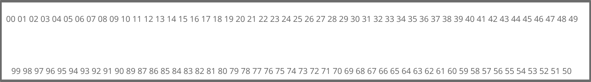

# ACI Hardware Data Transfer Protocol Specification Version 1

This specification describes a data transfer protocol for peripherals and hardware components connected to a microprocessor for general user and external system interaction.

The system operates by a serial clock performing 32-bit parallel data transfers at a negotiated clock rate. The data transfers are addressed by a 12-bit Address bus,
 allowing access to 16KiB of memory per device, and is selected by a 16-bit device select identifer.

## §1 Connector

### §1.1 Connector pinout

128 connector pins are present on the connector. These pins allow a hybrid data tranfser. For efficiency, the pins are labeled in the connector diagram and in this document using hexadecimal notation with 2 digits. 
In this document, hexadecimal pin numbers are prefixed with 0x. 

Any pin not mentioned below is reserved for future use as must be tied by GND by the host and the device.

__Reserved Pins__

The following pins are reserved for future use, and must be tied to GND by the host and the device.
Neither the host nor the device may rely on any particular value for the pins.

__Power/Logic Level__

* 0x00: 12V power
* 0x02: 5V power
* 0x7E: 3.3V logic level

__GND__

* 0x01
* 0x03
* 0x11
* 0x2B
* 0x32
* 0x34
* 0x37
* 0x65
* 0x7D
* 0x7F

__DMA Address__
* 0x04: DMA Address 0
* 0x05: DMA Address 1
* 0x06: DMA Address 2
* 0x07: DMA Address 3
* 0x08: DMA Address 4
* 0x09: DMA Address 5
* 0x0A: DMA Address 6
* 0x0B: DMA Address 7
* 0x0C: DMA Address 8
* 0x0D: DMA Address 9
* 0x0E: DMA Address 10
* 0x0F: DMA Address 11

__Data Transfer__

(Note: Pins in this section are listed in order of the corresponding bit of the address)

* 0x5F: DMA Data 0
* 0x5E: DMA Data 1
* 0x5D: DMA Data 2
* 0x5C: DMA Data 3
* 0x5B: DMA Data 4
* 0x5A: DMA Data 5
* 0x59: DMA Data 6
* 0x58: DMA Data 7
* 0x57: DMA Data 8
* 0x56: DMA Data 9
* 0x55: DMA Data 10
* 0x54: DMA Data 11
* 0x53: DMA Data 12
* 0x52: DMA Data 13
* 0x51: DMA Data 14
* 0x50: DMA Data 15
* 0x4F: DMA Data 16
* 0x4E: DMA Data 17
* 0x4D: DMA Data 18
* 0x4C: DMA Data 19
* 0x4B: DMA Data 20
* 0x4A: DMA Data 21
* 0x49: DMA Data 22
* 0x48: DMA Data 23
* 0x47: DMA Data 24
* 0x46: DMA Data 25
* 0x45: DMA Data 26
* 0x44: DMA Data 27
* 0x43: DMA Data 28
* 0x42: DMA Data 29
* 0x41: DMA Data 30
* 0x40: DMA Data 31

__Hot Plug/Dynamic Initialization__

* 0x30: Device Id PRG
* 0x31: Device Power Connected
* 0x33: Hot Plug Enable

__Device Selector__

* 0x18: Device Select 0
* 0x19: Device Select 1
* 0x1A: Device Select 2
* 0x1B: Device Select 3
* 0x1C: Device Select 4
* 0x1D: Device Select 5
* 0x1E: Device Select 6
* 0x1F: Device Select 7
* 0x20: Device Select 8
* 0x21: Device Select 9
* 0x22: Device Select 10
* 0x23: Device Select 11
* 0x24: Device Select 12
* 0x25: Device Select 13
* 0x26: Device Select 14
* 0x27: Device Seelct 15

__Serial Data Transfer__

* 0x10: Serial Transfer Clock
* 0x2C: DMA Step Enable
* 0x2D: I/O Enable
* 0x2E: R/W Select
* 0x2F: Device Read Ready

__Interrupt connector__

* 0x38: Device to Host Interrupt Request
* 0x39: Host to Device Interrupt Request

__Multiple Host Interface__

* 0x60: Host Read Ready
* 0x61: Device R/W Select
* 0x62: Device I/O Enable
* 0x63: Device DMA Step Enable
* 0x64: Device Clock

### §1.2 Power and Logic Rails 

The Host supplies 3 input voltages to each device, being 12 V and 5 V for power, and 3.3V for Logic. 12 V supply is present on pin 0, 5V on pin 2, and 3.3V Logic is on pin 98. Supply and Logic voltages are relative to GND.

The Standard Ground is pin 99, and is connected to all other ground pins as a common ground, all voltages may be returned from a device on a ground pin.

All logic pins are triggered on 3.3V for a logical 1, and 0V for a logical 0. A device may place a 1 on the line by connecting the 3.3V logic supply pin 98 to the logic pin, and a device may place a 0 on the line by connecting the common GND pin to the logic supply. 

The host shall ensure it supplies 3.3V for a logical 1 and 0V for a logical 0 with up to ±0.25V error, and shall accept between 2.1V and 6V for a logical 1, and shall accept between 0.7V and -1.4V for a logical 0. 

As a convinence, devices may use the 5V supply voltage for logic return, rather than 3.3V, and hosts must support this behaviour. However, all logic input from the host will be 5V supply.

## §2 Data Transfer and Clock

### §2.1 Clock Frequency

The Host shall supply the serial transfer clock to all devices on pin 41. The clock should generally be shared among devices, but a device placing a logic value on the clock line shall not interfere with any other device. According to the clock frequency, the clock shall be raised by the host to logic level 1 and then down to logic level 0 on a fixed interval, such that it becomes a particular logical level a number of times per second equal to the current clock frequency.

The Clock by default operates at 100 MHz and all devices must support this clock frequency at a minimum. During Device Initialization, a clock frequency is negotiated by the devices and the host, and may be up to the greatest frequency supported by all devices, in multiples of 2 kHz (see §3.2). When the clock speed is changed (see §3.2), 8 clock cycles are given in the old frequency, followed by a period of low signal equivalent to 8 cycles in the old frequency, followed by 8 cycles in the new frequency prior to any data transfers or comands being given.

### §2.2 Device Selection, DMA Address, DMA Data

The device selection bus is a 16-bit host to device bus, that stores the device ID of the device to interact with. The value 0xFFFF refers to all connected and initialized devices - a host performing a read from all devices has no guaranteed result from any device, but writes may be performed to the same address with the same data.  Other values refer to a specific device and a device shall only respond to a transfer request with the device id programed during device initialization (see §3.1)

The DMA Address is the address to be accessed by the DMA Transfer, and DMA Data is a bi-directional data bus that stores the data to be sent.

The Device ID must be placed on the bus before placing the DMA Address on the bus, at least one cycle apart. 
The DMA Address must be placed on the bus before I/O enable is set, at least one cycle apart. 

### §2.3 DMA Transfers

Prior to setting I/O Enable, Device ID and DMA Address must both be present on the respective busses, 
 and have been present for at least one cycle.

The following timing specification is used to indicate the transfer protocol:
* Cycle 0: I/O Enable line must be set at the rising edge of the clock cycle. DMA Address and ID Select must be latched by the device during the falling edge of this cycle.
* Cycle 1-3: The R/W Select and DMA Step Enable signals must be set by the host to their appropriate value as desired for the particular transfer at the rising edge of any of these cycles.
* Cycle 3: The R/W Select and DMA Step Enable signals must be latched by the device at the falling edge.
* Cycle N (N>=3): During the falling edge, if R/W Select is low (read operation), the device places a logical 1 on this signal to indicate that it is ready for a transfer. 
* Cycle N+1: At the Rising Edge, the data is placed on the bus by the host (R/W Select=1), or the device (R/W Select=0), on the Falling edge, the data is read by the host (R/W Select=0), or the device (R/W Select=1).
* Cycle N+2+: If the I/O Enable line is `1` at the rising edge, the data for the successive transfer is placed on the bus at the rising edge, and read at the falling edge.
* Cycle K (K>=N+2): The I/O Enable line is cleared before the Rising edge, the DMA Transfer is completed.

Cycle N and Cycle K are a variable number of cycles (including 0) after the previous step. They are chosen when the constraint placed on that cycle is satified. 

(Note: In the case of a write, Cycle N is Cycle 3, as the condition is trivially satisfied)

The I/O Enable Line may be cleared at the falling edge of the last cycle to transfer on.

The R/W Select line controls the direction of the transfer relative to the host - a `0` selects a read (device to host transfer), and a `1` selects a write (host to device transfer).

The DMA Step Enable line controls the behaviour when performing multiple transfers betwen the I/O Select line going high, and the I/O Select line going low. Either the operation can affect a single address multiple times (for example, if the address designates a serial port or some other type of connector) or may affect multiple consecutive address (for example, if the address range designates device-specific RAM). A `0` selects repeated operations on the same address, and a `1` selects repeated operations on successive addresses. 

Both signals are set on cycles 1-3 of the DMA Transfer Operation, and are latched on the 3rd cycle. 

## §3 Device Initializaiton

### §3.1 Device Initialization Procedures

When devices are initialized during system startup, or when connected using device plug and play,
 a handshake is performed. 

 Two pins are exposed for the purpose of detecting the presence of a device/host, 
  the Device Power Connected pin (pin 47) must be connected to the 3.3V logic supply pin (pin 98). 

The host connector must detect this line through a pull down resistor, and return it on the Hot Plug Enable line, which is detected by the device through a pull down resistor. Neither signal shall be operatable by signal noise present on 
an unconnected pin.

During Device Initiaization in Plug and Play mode, if the host is operating at a clock speed greater than 100MHz, it must transition all devices sharing a clock with the to-be-initialized device down to 100 MHz mode prior to initializing the Device ID or performing Clock Negotiation. During startup, the host is expected to operate the clock at the base speed of 100MHz

After a device is connected, with the clock operating at 100 MHz, the host must assign it a Device ID, by placing the device ID to be assigned onto the Device ID bus, and then 1 cycle later, bring the Device ID PRG line for the device to High for two cycles, then bring the Device ID PRG line low. 

At most one device may be assigned any particular ID at a time, and the Device ID 0xFFFF may not be assigned to any device. THere are no further restrictions on device ID assignment by the host.

Any Device must accept a Device ID Program request at any time during its operation that a DMA Transfer to it is not being performed.

### §3.2 Clock Negotiation

Once all devices are intialized, the host may, at it's option, peform a clock negotiation on all devices.

It must scan through each device and read address 0x008, which contains the maximum clock frequency in steps of 10 kHz above 100MHz supported by the device. Every device that advertises a specific maximum clock frequency must be operable with a clock frequency below that, but 100MHz at a minimum.

After determining the maximum supported clock frequency, it may perform a clock change by writing the intended clock frequency in steps of 10 kHz above 100MHz to address 0x008 using the broadcast id 0xFFFF.
When using non-shared clock signals, the host must update all devices connected to a particular clock signal simultaneously in any way it chooses (which may include using the Device ID directly, programming a shared ID then using it, or using a non-shared device id bus with the broadcast id). Devices must not assume that a clock change request is made using the broadcast id. 

After writing the new frequency, prior to performing any transfers to device id assignments, the host must issue 8 clock cycles on the previous frequency, 
 followed by a period where the clock line is set to logic 0 equal to 8 cycles on the new frequency, 
 followed by 8 cycles on the new frequency.

## §4 Device Identity Registers

The first 16 addresses are reserved for the device identity registers by this specification.
These devices have fixed functionality according to the specifcation, and devices must provide the behaviour specified by this specification.

| Address | Name | Read Value | Behaviour on Write |
|-|-|-|-|
|0x000|Device Class/Subclass|Top 16 bits store the class id assigned by the Clever-ISA Project or AbleCorp, bottom 16 bits store the subclass id assigned by the class registrant| Discarded by device |
|0x001|Device Vendor/Product|Top 16 bits store the vendor id assigned by the Clever-ISA Project or AbleCorp, bottom 16 bits stores the product id assigned by the vendor| Discarded by device |
|0x002|ACI Version|The version of the ACI protocol supported (Devices complying with ths specification shall return the value 1)| Discarded by Device |
|0x008|Maximum Clock Speed|Returns the maximum clock speed supported by the device, in steps of 10 kHz above 100 MHz| Sets the target clock speed after a clock change |

All other fields must read zero and writes must be discarded by the device. Hosts must not write to the address, and must not assume any particular value for the field. 

### §4.1 Class/Subclass ID

The device Class and Subclass describe the properties of the device. 
Each device is broken into a class, which describes the general characteristics of the device's behaviour,
 and a subclass, which describes the specifics of how the behaviour functions.

Classes are assigned by a registrar, and subclasses are assigned by the subclass registry owner. 

The Class IDs 0x0000 and 0xFFFF are reserved for unclassifed or unknown devices.
The Subclass ids 0x0000:0x0000 is reserved for a not-present device, and the subclass id 0xFFFF:0xFFFF is reserved for an invalid device.