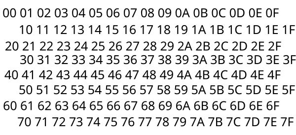

# ACI Hardware Data Transfer Protocol Specification Version 1

This specification describes a data transfer protocol for peripherals and hardware components connected to a microprocessor for general user and external system interaction.

The system operates by a serial clock performing 32-bit parallel data transfers at a negotiated clock rate. The data transfers are addressed by a 12-bit Address bus,
 allowing access to 16KiB of memory per device, and is selected by a 16-bit device select identifer.

## §1 Connector

### §1.1 Connector pinout

100 connector pins are present on the connector. These pins allow a hybrid data transer

Any pin not mentioned below is reserved for future use as must be tied by GND by the host and the device.

__Power/Logic Level__

* 0: 12V power
* 2: 5V power
* 98: 3.3V logic level

__GND__

* 1
* 3
* 18
* 23
* 40
* 42
* 44
* 46
* 48
* 53
* 63
* 97
* 99

__DMA Address__
* 4: DMA Address 0
* 5: DMA Address 1
* 6: DMA Address 2
* 7: DMA Address 3
* 8: DMA Address 4
* 9: DMA Addres 5
* 12: DMA Address 6
* 13: DMA Address 7
* 14: DMA Address 8
* 15: DMA Address 9
* 16: DMA Address 10
* 17: DMA Address 11

__Data Tranfser__

* 95: DMA Data 0
* 94: DMA Data 1
* 93: DMA Data 2
* 92: DMA Data 3
* 91: DMA Data 4
* 90: DMA Data 5
* 89: DMA Data 6
* 88: DMA Data 7
* 87: DMA Data 8
* 86: DMA Data 9
* 85: DMA Data 10
* 84: DMA Data 11
* 83: DMA Data 12
* 82: DMA Data 13
* 81: DMA Data 14
* 80: DMA Data 15
* 79: DMA Data 16
* 78: DMA Data 17
* 77: DMA Data 18
* 76: DMA Data 19
* 75: DMA Data 20
* 74: DMA Data 21
* 73: DMA Data 22
* 72: DMA Data 23
* 71: DMA Data 24
* 70: DMA Data 25
* 69: DMA Data 26
* 68: DMA Data 27
* 67: DMA Data 28
* 66: DMA Data 29
* 65: DMA Data 30
* 64: DMA Data 31

__Hot Plug/Dynamic Initialization__

* 45: Device Id PRG
* 47: Device Power Connected
* 49: Hot Plug Enable

__Device Selector__

* 24: Device Select 0
* 25: Device Select 1
* 26: Device Select 2
* 27: Device Select 3
* 28: Device Select 4
* 29: Device Select 5
* 30: Device Select 6
* 31: Device Select 7
* 32: Device Select 8
* 33: Device Select 9
* 34: Device Select 10
* 35: Device Select 11
* 36: Device Select 12
* 37: Device Select 13
* 38: Device Select 14
* 39: Device Seelct 15

__Serial Data Transfer__

* 41: Serial Transfer Clock
* 50: DMA Step Enable
* 51: I/O Enable
* 52: R/W Select

### §1.2 Power and Logic Rails 

The Host supplies 3 input voltages to each device, being 12 V and 5 V for power, and 3.3V for Logic. 12 V supply is present on pin 0, 5V on pin 2, and 3.3V Logic is on pin 98. Supply and Logic voltages are relative to GND.

The Standard Ground is pin 99, and is connected to all other ground pins as a common ground, all voltages may be returned from a device on a ground pin.

All logic pins are triggered on 3.3V for a logical 1, and 0V for a logical 0. A device may place a 1 on the line by connecting the 3.3V logic supply pin 98 to the logic pin, and a device may place a 0 on the line by connecting the common GND pin to the logic supply. 

The host shall ensure it supplies 3.3V for a logical 1 and 0V for a logical 0 with up to ±0.25V error, and shall accept between 2.1V and 6V for a logical 1, and shall accept between 0.7V and -1.4V for a logical 0. 

As a convinence, devices may use the 5V supply voltage for logic return, rather than 3.3V, and hosts must support this behaviour. However, all logic input from the host will be 5V supply.

## §2 Data Transfer and Clock

### §2.1 Clock Frequency

The Host shall supply the serial transfer clock to all devices on pin 41. The clock should generally be shared among devices, but a device placing a logic value on the clock line shall not interfere with any other device. According to the clock frequency, the clock shall be raised by the host to logic level 1 and then down to logic level 0 on a fixed interval, such that it becomes a particular logical level a number of times per second equal to the current clock frequency.

The Clock by default operates at 100 MHz and all devices must support this clock frequency at a minimum. During Device Initialization, a clock frequency is negotiated by the devices and the host, and may be up to the greatest frequency supported by all devices, in multiples of 2 kHz (see §3.2). When the clock speed is changed (see §3.2), 8 clock cycles are given in the old frequency, followed by a period of low signal equivalent to 8 cycles in the old frequency, followed by 8 cycles in the new frequency prior to any data transfers or comands being given.

### §2.2 Device Selection, DMA Address, DMA Data

THe device selection bus is a 16-bit host to device bus, that stores the device ID of the device to interact with. The value 0xFFFF refers to all connected and initialized devices - a host performing a read from all devices has no guaranteed result from any device, but writes may be performed to the same address with the same data.  Other values refer to a specific device and a device shall only respond to a transfer request with the device id programed during devise initialization (see §3.1)

